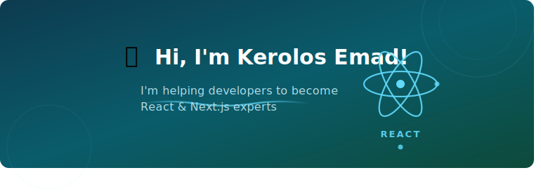

---

## 👨‍💻 About Me

Passionate **Front-End Developer** focused on building responsive, user-friendly, and modern web applications using the latest web technologies.

- 🔭 Currently working on **React + TypeScript projects**
- 🌱 Learning **Advanced React Patterns & Front-End Architecture**
- 🎯 Goal: Remote Front-End Developer opportunity
- ⚡ Fun fact: I love turning complex problems into clean UIs

---

## 🚀 Tech Stack

### Front-End

### Styling

### Tools

---

## 📚 Currently Learning

- ⚛️ Advanced React Patterns
- 🏗️ Front-End Architecture
- ⚡ Performance Optimization
- 🌐 Next.js

---

## 💻 Featured Projects

| Project | Description | Tech | Link |
|---------|-------------|------|------|
| 🛒 **E-Commerce Store** | Modern online store with cart, auth & REST APIs | React, TypeScript, Redux | [View Repo](#) |
| ✅ **Task Management App** | CRUD app with responsive design | React, TypeScript | [View Repo](#) |
| 📊 **Admin Dashboard** | Interactive dashboard with charts & analytics | React, Chart.js | [View Repo](#) |

---

## 📊 GitHub Stats

---

## 📫 Connect With Me

